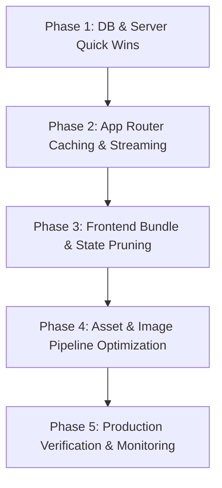

# 🚀 Comprehensive High-Performance & Low-Latency Architecture Plan
**Target System:** Next.js 14 (App Router) + MongoDB (Mongoose) + Redux Toolkit + SCSS  
**Goal:** Maximize application speed, achieve sub-100ms backend response times, optimize Core Web Vitals (LCP < 1.2s, INP < 50ms, CLS = 0), eliminate wasteful frontend/backend overhead, and establish scalable caching.

---

## 📑 Table of Contents
1. [Core Performance Goals & Targets](#1-core-performance-goals--targets)
2. [Backend & Database Optimization (Decreasing TTFB & Server Response Time)](#2-backend--database-optimization)
3. [Next.js App Router & Architecture Strategies](#3-nextjs-app-router--architecture-strategies)
4. [Frontend Optimization (Client-Side Speed & Rendering)](#4-frontend-optimization)
5. [Eliminating Unnecessary Measures & Anti-Patterns](#5-eliminating-unnecessary-measures--anti-patterns)
6. [Asset, Image, Style & Font Optimization](#6-asset-image-style--font-optimization)
7. [Step-by-Step Implementation Roadmap](#7-step-by-step-implementation-roadmap)
8. [Monitoring, Benchmarking & Continuous Verification](#8-monitoring-benchmarking--continuous-verification)

---

## 1. Core Performance Goals & Targets

| Metric | Current Baseline (Est.) | Target Benchmark | Impact |
| :--- | :--- | :--- | :--- |
| **TTFB (Time To First Byte)** | ~400ms – 1.2s | **< 150ms** | Instant server response & navigation |
| **LCP (Largest Contentful Paint)** | ~2.5s – 4.0s | **< 1.2s** | Fast hero banner & above-the-fold render |
| **INP (Interaction to Next Paint)** | ~150ms – 250ms | **< 50ms** | Smooth UI response to clicks, filters & inputs |
| **CLS (Cumulative Layout Shift)** | > 0.1 | **< 0.02** | Zero layout jumping during dynamic section loading |
| **Client Bundle Size (Initial JS)** | ~350KB+ | **< 120KB** | Rapid parsing & JS execution on low-end devices |
| **MongoDB Query Execution Time**| ~50ms – 180ms | **< 5ms - 15ms** | Minimal DB overhead with indexing & lean projections |

---

## 2. Backend & Database Optimization

### 2.1. MongoDB Connection Pooling & Resilience
- **Persistent Connection Reuse:** Verify `mongoose.connect` uses a single shared pool across serverless / Node invocations.
- **Tuned Pool Configuration:**
  ```typescript
  // lib/dbConnect.ts
  const opts: mongoose.ConnectOptions = {
    bufferCommands: false, // Avoid buffering overhead when connection drops
    maxPoolSize: 20,       // Sufficient for concurrent user queries
    minPoolSize: 5,        // Maintain warm connections
    serverSelectionTimeoutMS: 5000,
    socketTimeoutMS: 45000,
    family: 4,             // Force IPv4 to prevent IPv6 DNS lookup delays
  };
  ```

### 2.2. Query Level Optimizations (Mongoose)
- **Always Use `.lean()` for Read Operations:**
  - Standard Mongoose documents create heavy JavaScript instances with getters, setters, and internal change-tracking state.
  - `.lean()` returns plain JSON objects, reducing memory overhead by **70–80%** and cutting query execution time by up to **4x**.
  ```typescript
  // Example: Fast read query
  const products = await ProductModel.find({ to_home: true })
    .select('title price image rating category static_id slug') // Projection
    .lean()
    .exec();
  ```
- **Strict Field Projections (`.select()`):**
  - Never query `find()` without specifying needed fields. Exclude large descriptions, internal logs, and raw arrays when rendering product cards or list tiles.
- **Compound Database Indexing:**
  Create precise indexes matching query access patterns in your MongoDB collections:
  ```typescript
  // Product Schema Indexes
  ProductSchema.index({ to_home: 1, sortOrder: 1 });
  ProductSchema.index({ static_id: 1 });
  ProductSchema.index({ category: 1, price: 1 });
  ProductSchema.index({ slug: 1 }, { unique: true });
  ```
- **Cursor/Keyset Pagination over Offset (`skip/limit`):**
  - Offset pagination with `.skip(1000)` causes MongoDB to scan and discard 1,000 documents.
  - Keyset pagination (e.g., `_id: { $lt: lastSeenId }`) performs an instant `O(1)` index seek.

### 2.3. Server-Side In-Memory & Tagged Caching
- **Next.js `unstable_cache` for Database Queries:**
  Wrap heavy database queries (such as home dynamic sections, categories tree, deal offers) with Next.js tagged caching:
  ```typescript
  import { unstable_cache } from 'next/cache';

  export const getCachedHomeSections = unstable_cache(
    async () => {
      await dbConnect();
      return await HomeSectionModel.find({ isActive: true })
        .sort({ sortOrder: 1 })
        .lean();
    },
    ['home-sections-cache'],
    { revalidate: 300, tags: ['home-sections'] } // 5 minutes cache or on-demand revalidation
  );
  ```
- **On-Demand Cache Invalidation:**
  When an admin updates a section or product via the dashboard, call `revalidateTag('home-sections')` instead of invalidating everything.

---

## 3. Next.js App Router & Architecture Strategies

### 3.1. Maximize Server Components (RSC)
- Keep components as **React Server Components (RSC)** by default.
- Only mark components with `'use client'` when they require user interactivity (event handlers like `onClick`, React state `useState`, or browser APIs).
- **RSC Benefits:** Zero JS sent to client for static presentation, direct DB access without internal HTTP roundtrips, fast streaming HTML.

### 3.2. Streaming Architecture with Granular Suspense Boundaries
- Avoid blocking the whole page while fetching dynamic sections.
- Keep the main page frame (Header, Category Navigation, Hero Cover) static/fast-rendered, and wrap heavy dynamic widgets inside focused `<Suspense>` boundaries with matching skeleton placeholders.
```tsx
// app/[locale]/(main)/page.tsx
export default function HomePage({ params: { locale } }: Props) {
  return (
    <>
      <Header page="home" />
      <CategoriesLinksSwipper />
      
      <main className="home container">
        {/* Critical Above-the-fold component */}
        <HomeCover />

        {/* Dynamic & DB dependent sections streamed asynchronously */}
        <Suspense fallback={<DealsSkeleton />}>
          <DealOffersSection locale={locale} />
        </Suspense>

        <Suspense fallback={<ProductGridSkeleton />}>
          <RecommendedProductsSection locale={locale} />
        </Suspense>
      </main>
    </>
  );
}
```

### 3.3. Elimination of Internal API Roundtrips
- **Anti-Pattern:** A Server Component calling `fetch('http://localhost:3000/api/products')`. This adds HTTP serialization, network stack latency, and DNS overhead.
- **Best Practice:** Call database service functions (`getProductsDirect()`) directly inside Server Components and Server Actions.

---

## 4. Frontend Optimization

### 4.1. Code Splitting & Dynamic Imports for Heavy Client Libraries
Certain libraries in `package.json` are heavy and should **never** be loaded in the initial bundle:
- **Leaflet (`leaflet`, `react-leaflet`):** Load dynamically only when user visits the map/delivery tab.
- **Recharts (`recharts`):** Load dynamically only inside the admin analytics dashboard.
- **Stripe (`@stripe/stripe-js`):** Load only on the checkout step.
- **Swiper:** Import only required modules (`Navigation`, `Pagination`, `Autoplay`) instead of full bundle.

```tsx
// Lazy load heavy components
import dynamic from 'next/dynamic';

export const DynamicMap = dynamic(() => import('@/components/common/DeliveryMap'), {
  ssr: false,
  loading: () => <div className="map-skeleton h-[300px] bg-gray-100 animate-pulse rounded" />,
});

export const DynamicAnalyticsChart = dynamic(
  () => import('@/components/dashboard/AnalyticsChart'),
  { ssr: false }
);
```

### 4.2. FontAwesome Icon Tree-Shaking
- **Anti-Pattern:** Importing icons indiscriminately or importing full packages.
- **Best Practice:** Use individual direct imports:
  ```typescript
  import { faHeart } from '@fortawesome/free-solid-svg-icons/faHeart';
  import { faCartShopping } from '@fortawesome/free-solid-svg-icons/faCartShopping';
  ```

### 4.3. Redux Store & Client State Optimization
- **Do NOT Store Static/Server Data in Redux:** Home sections, full category lists, and static product catalogs do not need to live in Redux state if they are already server-rendered.
- **Keep Redux Lean:** Limit Redux to genuine client-only state (Cart items, Favorites toggles, User auth session flags, UI drawer states).
- **Selector Memoization:** Use `createSelector` from `@reduxjs/toolkit` to avoid recalculating filtered lists on every component re-render.

---

## 5. Eliminating Unnecessary Measures & Anti-Patterns

### 5.1. Unnecessary Data Redundancy
- **Issue:** Large files like `data.ts` (~208KB), `db.ts` (~88KB), and `db-id.ts` (~88KB) embedded directly in the repository could inadvertently be bundled into client bundles if imported improperly.
- **Fix:** Keep static mock data strictly isolated to seed scripts or test environments. Never import large static arrays in shared utility files.

### 5.2. Double-Fetching Prevention
- **Issue:** Server component renders data, then a client component executes a `useEffect()` on mount to fetch the same data again into Redux.
- **Fix:** Pass initial data from Server Component to Client Component via props or initialize client state directly with Server Component props.

### 5.3. Lean Middleware Execution
- Inspect `middleware.ts` to ensure it skips early for static assets, public images, icons, and API paths without executing session decodes or complex operations:
```typescript
export const config = {
  matcher: [
    /*
     * Match all request paths except:
     * - _next/static (static files)
     * - _next/image (image optimization files)
     * - favicon.ico (favicon file)
     * - public folder files (.svg, .png, .jpg, .webp, etc.)
     */
    '/((?!_next/static|_next/image|favicon.ico|.*\\.(?:svg|png|jpg|jpeg|gif|webp)$).*)',
  ],
};
```

---

## 6. Asset, Image, Style & Font Optimization

### 6.1. Next.js Image Optimization (`next/image`)
- Replace standard `` tags with `next/image` to get automated WebP/AVIF compression, responsive `srcset`, and lazy loading.
- Set `priority` only on the **1 single LCP Hero image** above the fold.
- Supply correct `sizes` attribute to prevent downloading oversized desktop images on mobile:
  ```tsx
  <Image
    src={product.image}
    alt={product.title}
    fill
    sizes="(max-width: 640px) 100vw, (max-width: 1024px) 50vw, 25vw"
    className="object-cover"
    loading="lazy"
  />
  ```

### 6.2. Next.js Compiler & Configuration Hardening
Update `next.config.mjs` to enable production-grade compression and asset optimization:
```javascript
/** @type {import('next').NextConfig} */
const nextConfig = {
  reactStrictMode: true,
  swcMinify: true,
  compiler: {
    removeConsole: process.env.NODE_ENV === 'production' ? { exclude: ['error', 'warn'] } : false,
  },
  images: {
    formats: ['image/avif', 'image/webp'],
    minimumCacheTTL: 60 * 60 * 24 * 30, // 30 days cache for optimized images
    remotePatterns: [
      { protocol: 'https', hostname: 'lh3.googleusercontent.com', pathname: '/**' },
      { protocol: 'https', hostname: 'res.cloudinary.com', pathname: '/**' },
    ],
  },
  compress: true,
  poweredByHeader: false, // Security & slight payload saving
};

export default nextConfig;
```

### 6.3. SCSS & Style Performance
- **Avoid Massive Deeply Nested Selectors:** Deep CSS selectors increase style calculation time and selector matching costs in the browser engine.
- **Extract Critical Layout Dimensions:** Give fixed aspect ratios (`aspect-ratio: 16 / 9` or `aspect-ratio: 1 / 1`) to product card image wrappers to completely eliminate Cumulative Layout Shift (CLS).

### 6.4. Font Optimization
- Use `next/font/google` with `display: 'swap'` and `preload: true` to prevent FOIT (Flash of Invisible Text) and render text instantly.

---

## 7. Step-by-Step Implementation Roadmap



### ⚡ Phase 1: Database & Backend Quick Wins (Immediate Impact)
- [ ] Add `.lean()` and `.select(...)` to all read queries in `lib/db/` and `lib/services/`.
- [ ] Ensure MongoDB connection pool settings in `lib/dbConnect.ts` have `bufferCommands: false` and tuned pool size.
- [ ] Add compound indexes in MongoDB schemas (`to_home`, `static_id`, `category`, `slug`).

### ⚡ Phase 2: App Router Caching & Streaming
- [ ] Implement `unstable_cache` with cache tags for home sections and product catalogs.
- [ ] Replace any internal `fetch('http://.../api/...')` in Server Components with direct DB service invocations.
- [ ] Refactor `app/[locale]/(main)/page.tsx` dynamic sections to stream with granular `<Suspense>` boundaries.

### ⚡ Phase 3: Client-Side Bundle & Code Splitting
- [ ] Wrap Leaflet, Recharts, and Stripe with `next/dynamic({ ssr: false })`.
- [ ] Audit FontAwesome imports and use direct icon path imports.
- [ ] Strip out non-interactive `'use client'` directives across components.
- [ ] Clean up Redux store so server-rendered catalogs are not redundantly duplicated in client state.

### ⚡ Phase 4: Assets, Images & Styles
- [ ] Enable AVIF/WebP formats and `minimumCacheTTL` in `next.config.mjs`.
- [ ] Audit all image components: add `sizes`, set `priority` only on Hero image, add explicit aspect ratios to card containers.
- [ ] Remove console logs in production via SWC compiler options.

### ⚡ Phase 5: Verification & Continuous Monitoring
- [ ] Run production build `npm run build` and inspect the route bundle size table.
- [ ] Run Lighthouse audit (target: Performance Score > 95).
- [ ] Verify TTFB and server response times under load.

---

## 8. Monitoring, Benchmarking & Continuous Verification

### 8.1. Local Bundle Analyzer
Run `@next/bundle-analyzer` to visually inspect and eliminate unwanted large dependencies:
```bash
# Add analyzer
npm install -D @next/bundle-analyzer
```
```javascript
// next.config.mjs
import withBundleAnalyzer from '@next/bundle-analyzer';

const bundleAnalyzer = withBundleAnalyzer({
  enabled: process.env.ANALYZE === 'true',
});

export default bundleAnalyzer(nextConfig);
```

### 8.2. Core Web Vitals Real-User Monitoring (RUM)
Add Next.js Web Vitals reporting in `app/[locale]/layout.tsx`:
```typescript
export function reportWebVitals(metric: any) {
  if (process.env.NODE_ENV === 'production') {
    // Log or forward to analytics endpoint (e.g., Google Analytics, Vercel Analytics)
    console.log(metric);
  }
}
```

---
*Created for the Brand Mongo Next.js project. Execute according to the 5-phase roadmap to ensure high performance, low latency, and zero redundant overhead.*
